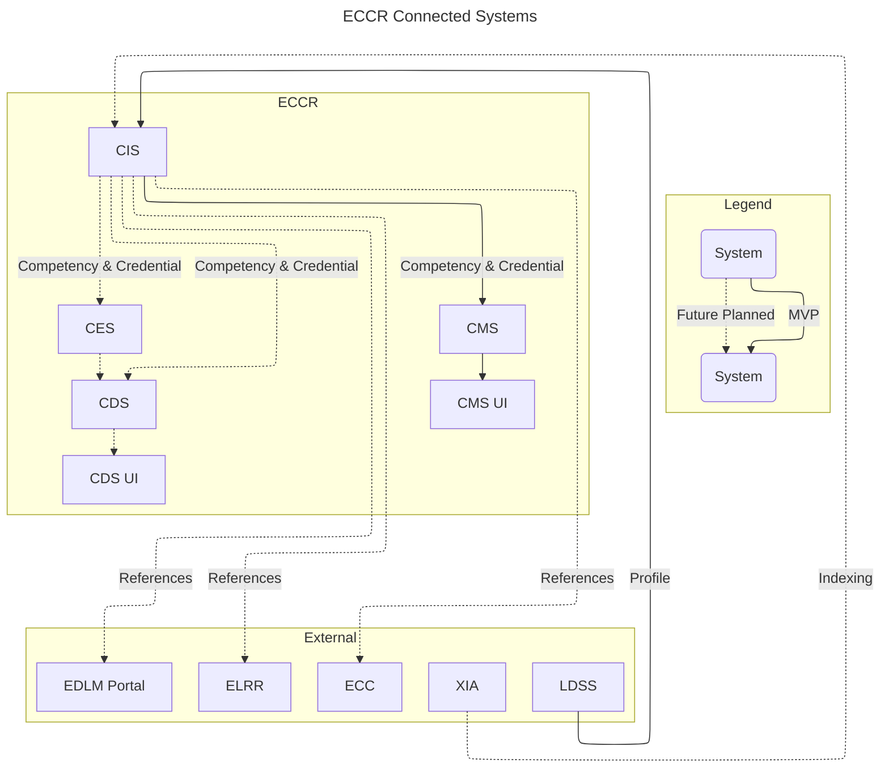
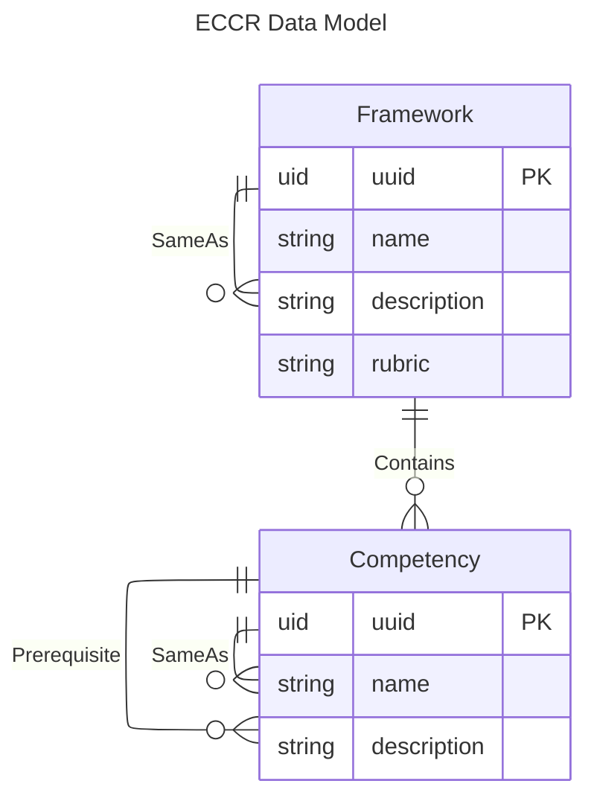

# ECCR-CIS

## ECCR System Architecture

```mermaid
---
config:
        layout: elk
title: ECCR Connected Systems
---
graph TD;
        subgraph Legend
                1("System")-->|MVP|2("System");
                1("System")-.->|Future Planned|2("System");
        end
        subgraph External
                LDSS;
                XIA;
                ECC;
                ELRR;
                EDLM[EDLM Portal];
        end
        subgraph ECCR
                CIS;
                CES;
                CDS;
                CMS;
                CDSUI[CDS UI];
                CMSUI[CMS UI];
        end
        LDSS-->|Profile|CIS;
        XIA-.->|Indexing|CIS;
        CIS-.->|References|ECC & ELRR & EDLM;
        CIS-->|Competency & Credential|CMS;
        CIS-.->|Competency & Credential|CDS & CES;
        CMS-->CMSUI;
        CDS-.->CDSUI;
        CES-.->CDS;
```

## ECCR Data Diagram

```mermaid
---
config:
        layout: elk
title: ECCR Data Model
---
erDiagram
    f[Framework]{
        uid uuid PK
        string name
        string description
        string rubric
    }
    c[Competency]{
        uid uuid PK
        string name
        string description
    }
    f 1--0+ f : SameAs
    f 1--0+ c : Contains
    c 1--0+ c : SameAs
    c 1--0+ c : Prerequisite
```

